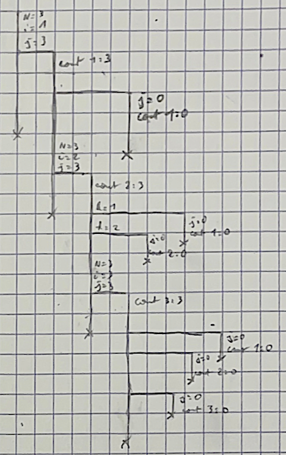

# tme6 : Processus, Fork, Signaux

Commencer par faire un "fork" du projet, puis travailler sur votre copie.

## Question 1

## Question 4

On veut attendre entre 0.3 et 1 seconde de facon random, pour cela on utilise
nanosleep, qui prend un nombre de nano secondes en parametre.

## Question 5

Pour que chacun des processus utilisent un graine aleatoire differente, on
appel `srand(time(NULL) + pid)` apres la creation du fils, donc la graine est
differente ce qui donne des valeurs differents.

## Question 6

Le combat n'est plus equitable car le fils recoit le signal seulement dans la
phase de defense, ou il parre, dans la phase d'attaque, le signal est masque.
